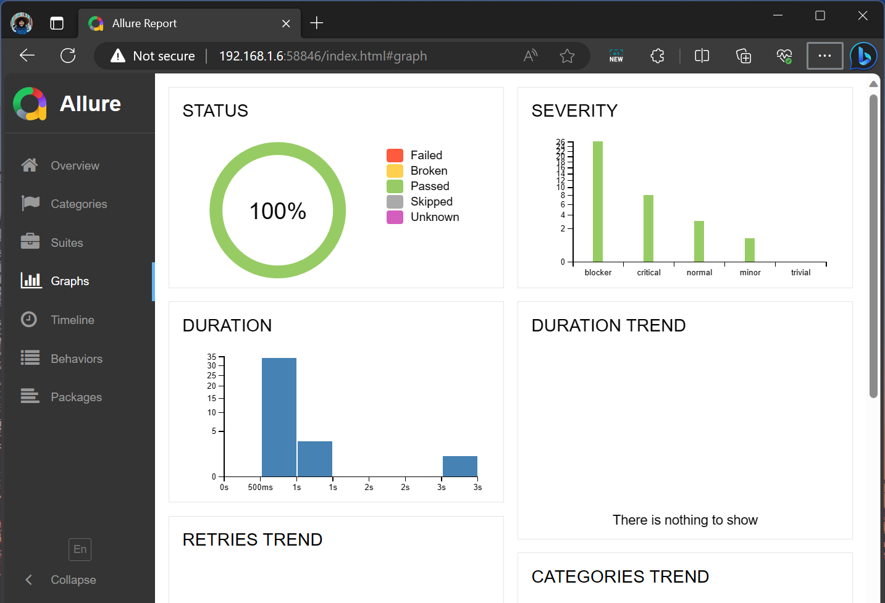

# API-Automation-Mocha-Chai

preparation

```sh
npm init
npm install

```

installation

```sh
npm install --save-dev mocha
npm install chai --save-dev
npm install chai-json-schema --save-dev
npm install chai-http --save-dev

```

Run All Scenarios

```sh
npm run test 
```

Running tests with mochawesome reports 

```sh
git checkout report-mochawesome
npm install --save-dev mochawesome
npm install --save-dev mochawesome-report-generator
npm run test:mochawesome
```


Running tests with allure reports 

```sh
git checkout report-allure
npm install --save-dev mocha-allure-reporter
npm install --save-dev allure-commandline
npm run auth:allure-report
```





Run Auth Scenarios

```sh
npm run auth
```

Run User Scenarios

```sh
npm run user

```

Run Unit Scenarios

```sh
npm run unit

```

Run Categories Scenarios

```sh
npm run categories

```

Run Customer Scenarios

```sh
npm run customer

```

Run Product Scenarios

```sh
npm run product

```

Run Transaction Scenarios

```sh
npm run transaction

```

Postman collections : https://drive.google.com/file/d/1b9yVDQLHAkDo026fLOiy2N_G23ygi8Fq/view?usp=sharing
Postman environtment : https://drive.google.com/file/d/1FlcNQXc1HI810tTB7Iru18GDkZoCZemj/view?usp=sharing
